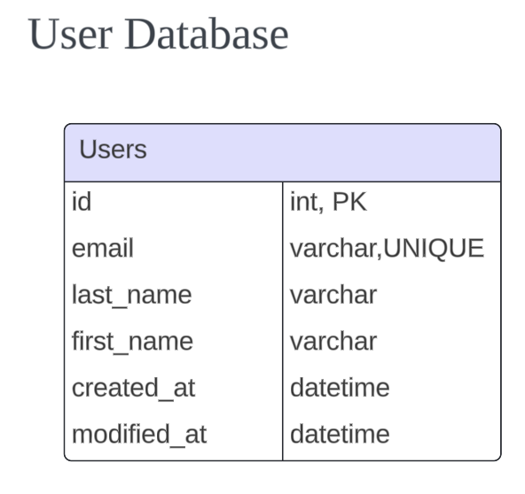
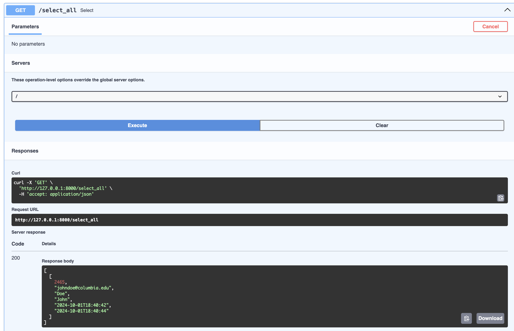

# Expense Tracker - User Microservice

## Endpoint

## Database

### Create table query
```mysql
CREATE DATABASE IF NOT EXISTS expense_tracker_users;

USE expense_tracker_users;

create table if not exists users
(
    id          int         not null
        primary key,
    email       varchar(64) null,
    last_name   varchar(32) null,
    first_name  varchar(32) null,
    created_at  datetime    null,
    modified_at datetime    null
);
```
### add dummy data
```mysql
USE expense_tracker_users;

INSERT INTO users (id, email, last_name, first_name, created_at, modified_at)
VALUES (2465, 'johndoe@columbia.edu', 'Doe', 'John', '2024-10-01 18:40:42', '2024-10-01 18:40:44');

```

### sample output

